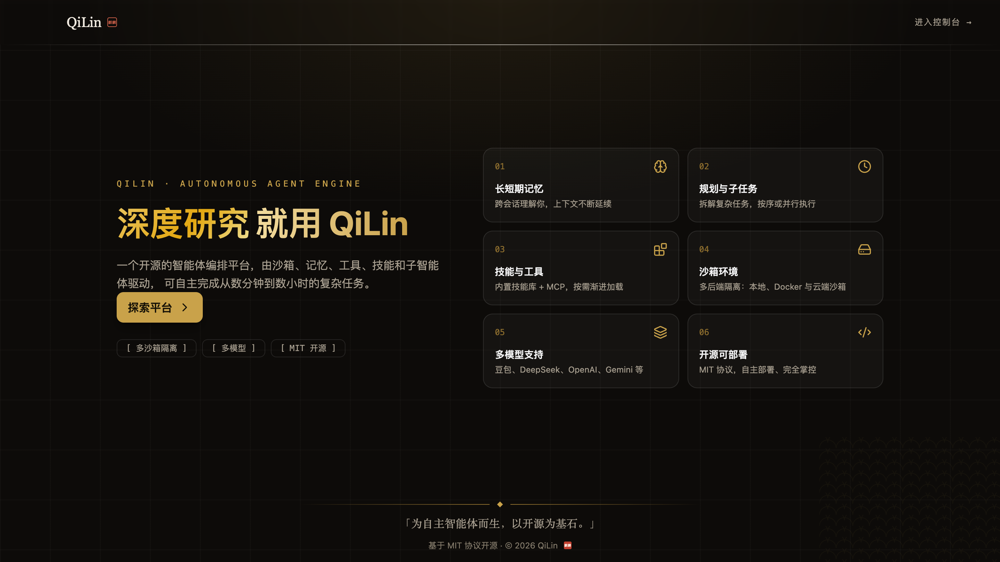

<p align="center">
  
</p>

# QiLin

**简体中文** · [English](README.en.md)

**QiLin** —— 生产级的智能体（Agent）引擎。
一个统一的 Python 包，把 LangGraph 状态机、模型调用、工具/技能生态、多智能体编排、子代理递归、沙箱隔离、权限模型、可观测性与定时调度整合在同一二进制 / 同进程中运行；并配套 **Web 工作台**与 **DSH 兼容插件生态**。

- **包名称 / Package**：`qilin`
- **当前版本 / Current**：**v2.0.2**（[版本演进](#-版本演进--release-history)）
- **引擎代码量 / Engine codebase**：`qilin/` 约 500 文件 · 23 个子系统；`web-demo/` 约 400 文件
- **Python**：≥ 3.12
- **CLI**：`qilin`

## ✨ 核心能力 / Core Capabilities

- **嵌入式 & 服务化双模运行** —— `QiLinClient` 进程内嵌入，或 FastAPI HTTP Agent Server 独立部署
- **LangGraph 兼容的内核** —— 状态机 + 中间件链，23 个高内聚子系统
- **多 Provider 模型适配** —— OpenAI / Anthropic / DeepSeek / Gemini / Ollama 等
- **多智能体编排** —— single/multi 配置切换、handoff 协议、编排图、AgentInbox 消息总线、并行批次、协作模式（orchestrator-workers / peer-consensus）
- **子代理递归 + 独立 checkpoint**
- **HTTP Agent Server** —— REST API + JWT 认证 + CSRF + GitHub Webhook
- **8 大 IM 渠道接入** —— 飞书 / Discord / Slack / Telegram / 钉钉 / 企微 / 微信 / GitHub
- **多沙箱后端** —— Local / aio_sandbox / boxlite / E2B
- **RBAC 风格的资源授权 + 多层循环检测护栏**
- **Langfuse / Monocle 双 trace 适配**
- **技能市场 + 静态/动态扫描 + SkillACP 兼容**（Agent Client Protocol）
- **Web 工作台**（Next.js）—— 会话流、工作区文件树与多格式查看器、xterm.js 终端、插件管理
- **DSH 插件生态兼容宿主** —— T1/T2/T3 插件协议 + 生命周期 CLI + npm 安装链路
- **「一切皆 port」架构** —— 终端 PTY / surface 查看器 / skills / language / fs-git 能力桥

## 🗺️ 版本演进 / Release History

### v1.0.0 · 单智能体框架（2026-07-29）

首个正式稳定版本。从 `deer-flow` 提取引擎内核并重命名为 `qilin`，确立「单主代理 + 工具式子代理」形态（lead agent 经 `task_tool` 层级委派，调用-返回-用完即弃）：

- LangGraph 状态机内核 + 中间件链，嵌入式 `QiLinClient` 入口
- 多 Provider 模型适配、工具/技能/MCP 生态、子代理递归
- 沙箱隔离、记忆与持久化 checkpoint、安全护栏、RBAC 授权
- Langfuse/Monocle 可观测性、Textual TUI、定时调度

### v2.0.0 · 多智能体框架 + 服务面（2026-08-07）

在单智能体基座上完成两大跨越（`orchestration.mode` 配置驱动，`single` 默认且 v1 行为完全不变）：

- **多智能体编排**：handoff 协议（`AgentHandoff/HandoffResult/HandoffError`）→ OrchestratorGraph 编排图 → AgentInbox 消息总线（每 agent 队列 + 订阅广播）→ 协作模式（orchestrator-workers / peer-consensus）
- **子代理并行批次执行**：Semaphore 限流 + 失败隔离
- **agent 身份 + per-agent token 配额 + trace 关联**
- **完整服务面 `app/`**：FastAPI HTTP Agent Server（REST + JWT/CSRF/Webhook）、8 大 IM 渠道接入层、定时任务 HTTP 服务；随 wheel 分发并建立 CI 打包门禁

### v2.0.1 · Web 工作台 + DSH 交互对齐（2026-08-29）

`web-demo`（Next.js）工作台首次交付，并对齐 DSH 交互范式：

- **工作区侧边栏**：工作区分组树、TanStack Query 数据层、移动端 drawer（<768px 底部抽屉）
- **文件查看器体系**：Markdown（mermaid + katex）/ PDF / 图片 / HTML（沙箱 iframe）/ CodeMirror 可编辑查看器，TabBar 面板 + 防抖持久化
- **DSH 风格消息时间流**：思考、正文与工具调用按真实顺序交替渲染，去卡片化；用户消息简约气泡
- **assistant 统一操作栏**：复制 / 线程分支（复制为新会话）/ 重新生成 + 响应时间、模型与 token 用量元数据；URL 路由同步
- **gateway 引擎侧**：工作区注册表（registry 线程在真实目录执行）、`sandbox_mode` 贯通至工具门、goal round-driver（事件溯源 CAS + SSE）、terminal-edge 语义
- 侧边栏折叠保留窄图标条、完全访问模式二次确认、版本徽章

### v2.0.2 · DSH 插件生态兼容宿主 + 一切皆 port（2026-09-02）

QiLin Web 工作台正式兼容 **DSH 插件生态**，并建立「**一切皆 port**」架构：

- **插件宿主内核**：DSH 插件协议 shim——`window.__ModuleLoader__.load` 加载协议、T1 tab 面板、T2 sidebar 服务（`qiLin.sidebar` 服务桥）、T3 会话内文件评审（uiConversation 事件 registry + undo/redo 全环）
- **真实第三方插件端到端**：kcoder-git-panel、kcoder-terminal、kcoder-language（中文回复验收）、kcoder-skills（37 技能物化验收）
- **插件生命周期**：`dsh plugin add/remove/upgrade/list` CLI + npm 安装链路（`npm pack` → 分发 → 清单 upsert）+ `/workspace/plugins` 管理页（安装/启停/卸载）
- **ports 架构**：终端端口（DSH 兼容协议 + POSIX PTY + Windows ConPTY 后端 + 8 个 DSH 兼容 LangChain 工具 + xterm.js 终端页）、SurfacePort + `sidebar_open` 工具、skills port、language port、tools/post-execute 事件面
- **能力桥**：围栏化 fs/git 服务注入插件宿主；pty→ports 桥摆脱 native 限制
- **品牌与体验**：麒麟双字方印 logo（favicon 同步）、消息页脚操作栏常驻 + 点赞点踩、新任务大按钮
- **质量**：ports 面鉴权兼容修复（403/401）、全仓审计清理（净删 1071 行、ruff 告警清零）；后端 pytest 999+、前端 vitest 391 全绿

### 开发中 / Unreleased

- **循环检测重构**：Layer 1 改连续链语义 + 精确参数规范化、阶梯式提醒（3/5/8 次提醒、12 次硬停）、被拒/失败重复调用提前打断；Layer 2 窗口频率检测保留
- **Web 体验**：turn 尾 `QiLin....` 朱砂波光状态字 + turn 用时统计、折叠侧边栏按钮归位品牌行
- **工程**：`release.yml` —— `v*` tag 推送自动过 CI 门禁并发布 GitHub Release

> 各版本完整说明见 [RELEASE_NOTES_v1.0.0.md](RELEASE_NOTES_v1.0.0.md) / [v2.0.0](RELEASE_NOTES_v2.0.0.md) / [v2.0.1](RELEASE_NOTES_v2.0.1.md) / [v2.0.2](RELEASE_NOTES_v2.0.2.md)。

## 📦 安装 / Installation

```bash
# 基础安装（仅内核）
pip install qilin

# 含 TUI 工作台
pip install "qilin[tui]"

# 完整可选功能
pip install "qilin[postgres,redis,monocle,browser,boxlite]"
```

可选 Extras：

| Extra | 引入 |
|-------|------|
| `tui` | Textual 终端 UI |
| `postgres` | asyncpg + langgraph-checkpoint-postgres |
| `redis` | Redis 流桥 |
| `monocle` | OpenTelemetry 观测 |
| `boxlite` | BoxLite 内核级沙箱 |
| `browser` | Playwright 浏览器自动化 |
| `pymupdf` | PyMuPDF Llama-text 增强 |
| `memory-zh` | jieba 中文分词 |
| `ollama` | Ollama 本地模型 |
| `groundroute` | GroundRoute 自定义检索 |
| `gateway` | FastAPI HTTP Agent Server（uvicorn / PyJWT / bcrypt） |
| `channels` | IM 渠道 SDK（钉钉 / Discord / 飞书 / Slack / Telegram 等） |

## 🚀 快速开始 / Quick Start

### Python API（嵌入式 / Embedded）

```python
from qilin.client import QiLinClient

client = QiLinClient()

# 一次性问答
answer = client.chat("解释一下 Transformer 的自注意力机制。", thread_id="my-thread")
print(answer)

# 流式事件
for event in client.stream("继续上一段对话"):
    print(event.type, event.data)
```

### TUI（终端 UI / Terminal Workbench）

```bash
# 启动 TUI（需 TTY）
qilin

# 一次性回答
qilin --print "What is the capital of France?"

# JSON 流式
echo "What is 2+2?" | qilin --json
```

### Web 工作台（Web Workbench）

```bash
# 1) 启动引擎服务面（默认端口 28081）
uvicorn app.gateway.app:app --port 28081

# 2) 另开终端，启动 Web 工作台（默认 http://localhost:28080，自动代理 gateway）
cd web-demo
pnpm install
pnpm dev
```

### 配置 / Configuration

将 `config.example.yaml` 拷贝为 `config.yaml`，填入至少一个 model：

```yaml
models:
  - name: openai-gpt4
    provider: openai
    model: gpt-4o
    api_key: ${OPENAI_API_KEY}

sandbox:
  type: aio_sandbox
  provider: qilin.community.aio_sandbox.aio_sandbox_provider:AioSandboxProvider
```

### Agent Server（HTTP 服务 / Service Mode）

```bash
# 安装服务端依赖
pip install "qilin[gateway,channels]"

# 启动 HTTP Agent Server
uvicorn app.gateway.app:app --port 8080
```

服务端提供 agents / threads / runs / memory / skills / mcp / uploads / channels / ports 等 REST API，
详见 [gateway 模块文档](docs/modules/gateway.md)；IM 渠道接入见 [channels 模块文档](docs/modules/channels.md)；
终端/表面等端口见 [ports 模块文档](docs/modules/ports.md)。

## 📂 项目结构 / Project Layout

```
.
├── pyproject.toml         # 包元信息 + CLI 注册
├── qilin/                 # 核心引擎（约 500 文件 / 23 个子系统）
│   ├── client.py          # QiLinClient 嵌入式入口
│   ├── agents/            # Lead Agent + 中间件 + 记忆后端
│   ├── subagents/         # 子代理执行器 + 注册中心
│   ├── orchestration/     # 多智能体编排（handoff/图/消息总线/协作）
│   ├── ports/             # 一切皆 port（终端 PTY/surface/skills/language 端口）
│   ├── tools/             # 工具注册与装配
│   ├── skills/            # 技能系统（含扫描器）
│   ├── mcp/               # MCP 协议适配
│   ├── runtime/           # LangGraph 运行 + checkpoint + 流桥
│   ├── persistence/       # 多后端持久化层
│   ├── scheduler/         # 定时任务调度
│   ├── config/            # Pydantic 配置 + 热重载
│   ├── sandbox/           # 沙箱抽象层
│   ├── guardrails/        # 安全护栏中间件（含循环检测）
│   ├── authz/             # RBAC 资源授权
│   ├── tracing/           # Langfuse / Monocle 追踪
│   ├── reflection/        # 变量解析（SkillACP）
│   ├── community/         # 第三方生态（搜索、沙箱等）
│   ├── integrations/      # Lark 等第三方渠道
│   ├── models/            # 模型适配
│   ├── tui/               # Textual 终端 UI
│   ├── uploads/           # 用户上传管理
│   ├── utils/             # 通用工具
│   └── workspace_changes/ # 工作区变更追踪
├── app/                   # 服务面（HTTP Agent Server + IM 渠道，随 wheel 分发）
│   ├── gateway/           # FastAPI HTTP Agent Server（REST + 认证 + webhook）
│   ├── channels/          # IM 渠道接入层（8 大渠道）
│   └── scheduler/         # 定时任务 HTTP 调度服务
├── web-demo/              # Web 工作台（Next.js + Tailwind：会话流/文件树/终端/插件管理）
├── skills/                # 内置技能资产
├── tests/                 # pytest 测试套件
├── docs/                  # 项目文档（架构 + 25 份模块详解）
│   ├── architecture.md
│   └── modules/*.md
└── scripts/               # 工程与验收脚本
```

## 📑 文档导航 / Documentation Index

| 文档 | 简介 |
|------|------|
| [架构总览](docs/architecture.md) | 三层架构、运行机制、可观测性、安全模型 |
| [gateway 模块](docs/modules/gateway.md) | HTTP Agent Server（REST API + 认证） |
| [channels 模块](docs/modules/channels.md) | IM 渠道接入（8 大渠道） |
| [agents 模块](docs/modules/agents.md) | Lead Agent 工厂与中间件链 |
| [subagents 模块](docs/modules/subagents.md) | 子代理执行与注册 |
| [orchestration 模块](docs/modules/orchestration.md) | 多智能体编排（handoff/图/消息总线/协作模式） |
| [ports 模块](docs/modules/ports.md) | 一切皆 port——DSH 兼容终端/表面端口（安装、环境变量、E2E） |
| [tools 模块](docs/modules/tools.md) | 工具装配流水线 |
| [skills 模块](docs/modules/skills.md) | 技能系统 |
| [mcp 模块](docs/modules/mcp.md) | MCP 协议适配 |
| [runtime 模块](docs/modules/runtime.md) | LangGraph 运行 + checkpoint |
| [persistence 模块](docs/modules/persistence.md) | 持久化层 |
| [scheduler 模块](docs/modules/scheduler.md) | 定时任务 |
| [config 模块](docs/modules/config.md) | 配置与热重载 |
| [sandbox 模块](docs/modules/sandbox.md) | 沙箱抽象 |
| [guardrails 模块](docs/modules/guardrails.md) | 安全护栏 |
| [authz 模块](docs/modules/authz.md) | 资源授权 |
| [tracing 模块](docs/modules/tracing.md) | 可观测性追踪 |
| [reflection 模块](docs/modules/reflection.md) | 变量解析 |
| [models 模块](docs/modules/models.md) | 模型适配层 |
| [community 模块](docs/modules/community.md) | 第三方生态 |
| [integrations 模块](docs/modules/integrations.md) | 渠道集成 |
| [tui 模块](docs/modules/tui.md) | 终端 UI |
| [uploads 模块](docs/modules/uploads.md) | 用户上传 |
| [utils 模块](docs/modules/utils.md) | 通用工具 |
| [workspace_changes 模块](docs/modules/workspace_changes.md) | 工作区变更 |

## ⚙️ 系统要求 / Requirements

- Python ≥ 3.12
- macOS / Linux（亦支持 WSL2）
- Node.js ≥ 20 + pnpm（仅 Web 工作台开发需要）
- 可选：Docker（用于 `aio_sandbox`）
- 可选：PostgreSQL ≥ 13、Redis ≥ 5（如启用）

## 📜 许可证 / License

Apache-2.0
