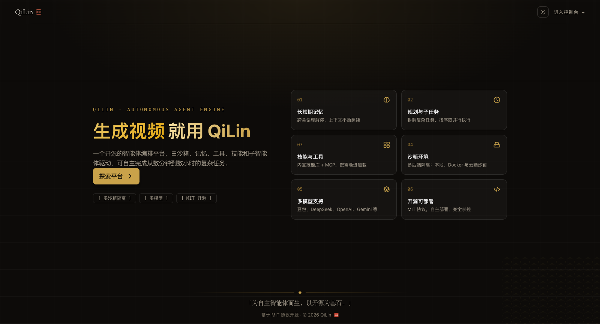

# QiLin

[English](README.md) | 中文

QiLin（`qilin`）是一个开源的 agent harness（智能体框架）。agent 在可持久化的会话中工作：读写与编辑文件、执行 shell 命令和持久终端、搜索网络、查询语言服务器，并把工作委派给 subagent 与后台任务；所有模型可见的输入与输出都记录到可重放的会话日志中。

它构建于**一切皆插件**的架构之上，由 [Cordis](https://github.com/cordiverse/cordis) 驱动；Cordis 源码以 vendor 方式收入本仓库并更名为 Kylin（见 [vendor/README.md](vendor/README.md)），其设计参见论文 [_A Programming Paradigm for Spatiotemporal Composability_](https://arxiv.org/abs/2608.25512)。模型适配器、工具注册表、会话日志以及 agent loop（智能体循环）本身都是插件，每一个都可以从配置中替换。



文档：[用户指南](docs/user/index.zh.md)、[开发指南](docs/development.zh.md)与[架构文档](docs/architecture.zh.md)。

## 开发者预览

QiLin 处于 _开发者预览_ 阶段，正在快速迭代。**未来将出现破坏兼容性的变更。**

运行本项目前，请阅读[安全说明](SAFETY.zh.md)。

## 架构


图中每条连接都有流动的数据包，配色跟随读者的浅色或深色偏好。可配合[架构文档](docs/architecture.zh.md)阅读。

## 能力

**入口模式。** [`qilin` CLI（命令行界面）](apps/cli/README.zh.md)通过具名 profile 从同一棵插件树启动所有模式：

- `qilin web` —— 浏览器 GUI：会话与聊天、模型配置、插件与设置管理、文件预览、终端以及会话历史。
- `qilin --profile headless "task"` —— 一次性持久化运行，打印最终回答后退出。
- `qilin --profile sdk` 与 `qilin --profile sdk-minimal` —— 由 [TypeScript](packages/sdk/README.zh.md) 与 [Python](python/README.zh.md) SDK 驱动的 JSON-RPC 服务器。
- `qilin --profile acp` —— 面向自动化客户端的 ACP（Agent Client Protocol）服务器。
- [桌面应用](apps/desktop/README.zh.md)以签名 Electron 应用的形式交付同一运行时。

**工具与执行。** 工具集覆盖一次性与持久 PTY 两种形式的 bash 与 PowerShell、文件读写编辑与图片读取、基于内置 ripgrep 的 glob/grep 发现、LSP 查询、网络搜索与抓取、skill（技能）、todo/plan/goal 跟踪以及向用户提问的 ask-user 交互。工作可委派给后台任务、支持模型选择与中途引导的 subagent、脚本化多 agent 工作流或定时跟进；会话支持 fork、恢复与全文检索。自动生成的[工具目录](docs/tool-catalog.zh.md)列出了全部面向模型的工具。

**模型。** DeepSeek 适配器与多提供方 `pi-ai` 适配器覆盖 Anthropic、OpenAI、Kimi、GLM 等内置提供方，以及自定义的 OpenAI 或 Anthropic 兼容网关；参见[配置模型](docs/user/guide/providers.zh.md)。

**执行世界与沙箱。** 文件系统、subprocess 与沙箱提供方构成一个可整体替换的执行世界：默认为本机，可通过成对提供方接入 SSH 远程主机，并可通过 bwrap、Landlock 或 Seatbelt 后端实施进程隔离。实验性包通过注册的提供方增加 browser-use 与 computer-use 交互。

**一切皆插件。** profile 在你自己的 `cordis.patch.yml` 之下叠加可 patch 的组合包层；`qilin plugin` 与 Web 插件管理器负责安装、启停和移除插件；外部 MCP 服务器挂载为原生工具；现有的 Claude Code 与 Codex shell hook 无需修改即可运行；经过验证的 webhook 会从外部事件启动会话。入门请阅读[你的第一个插件](docs/user/develop/basic/index.zh.md)、[架构文档](docs/architecture.zh.md)与[包地图](packages/README.zh.md)。

## 运行

### 从源码运行

如需从仓库源码运行：

```sh
git clone https://github.com/kkutysllb/QiLin.git
cd QiLin
pnpm install
pnpm run build
pnpm qilin web
```

`pnpm run build` 会准备仓库产物。`pnpm qilin web` 会直接使用这些已构建产物，不会重新构建。服务器默认在 `http://127.0.0.1:3080` 启动；传入 `--no-open` 可仅运行服务器而不打开浏览器。详见 [Web UI 指南](docs/user/guide/index.zh.md)。

## 参与贡献

参见 [CONTRIBUTING.md](CONTRIBUTING.zh.md)。

## 开发

请先阅读[开发指南](docs/development.zh.md)与[架构文档](docs/architecture.zh.md)。

面向 agent：请遵循 [AGENTS.md](AGENTS.md)。

## 许可证

[MIT](LICENSE)

第三方依赖及其许可证见 [THIRD_PARTY_NOTICES.md](THIRD_PARTY_NOTICES.md)。
